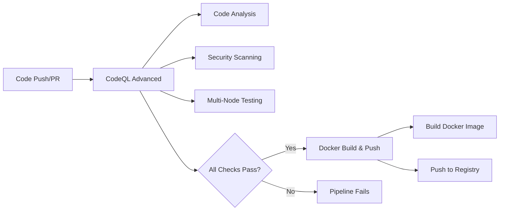

# CI/CD Pipeline

The LuaPlatform implements a comprehensive CI/CD pipeline using GitHub Actions to ensure code quality, security, and automated deployment. The pipeline includes code analysis, testing, and automated Docker image building and publishing.

## Pipeline Overview

The CI/CD pipeline consists of two main workflows:

1. **CodeQL Advanced** - Security scanning, code analysis, and testing
2. **Docker Build & Push** - Automated container image building and publishing

### Workflow Architecture



## CodeQL Advanced Workflow

### Overview

The CodeQL workflow provides comprehensive security analysis and testing across multiple Node.js versions.

**File**: `.github/workflows/codeql.yml`

### Trigger Conditions

```yaml
on:
  push:
    branches: ["main"]
  pull_request:
    branches: ["main"]
  schedule:
    - cron: "31 10 * * 3" # Weekly scan every Wednesday
```

**Trigger Events:**

- **Push to main**: Immediate analysis on main branch updates
- **Pull requests**: Analysis before merging changes
- **Scheduled**: Weekly security scans to detect new vulnerabilities

### Security Analysis Job

#### Configuration

```yaml
analyze:
  name: Analyze (${{ matrix.language }})
  runs-on: ubuntu-latest
  permissions:
    security-events: write # Required for security scanning
    packages: read # Access to private packages
    actions: read # Workflow permissions
    contents: read # Repository content access
```

#### Language Matrix

```yaml
strategy:
  fail-fast: false
  matrix:
    include:
      - language: javascript-typescript
        build-mode: none
```

**Supported Languages:**

- JavaScript/TypeScript analysis
- Extensible for other languages (Python, Java, C++, etc.)
- **Build Mode**: `none` for interpreted languages

#### Security Scanning Steps

1. **Repository Checkout**

   ```yaml
   - name: Checkout repository
     uses: actions/checkout@v4
   ```

2. **CodeQL Initialization**

   ```yaml
   - name: Initialize CodeQL
     uses: github/codeql-action/init@v3
     with:
       languages: ${{ matrix.language }}
       build-mode: ${{ matrix.build-mode }}
   ```

3. **Security Analysis**
   ```yaml
   - name: Perform CodeQL Analysis
     uses: github/codeql-action/analyze@v3
     with:
       category: "/language:${{matrix.language}}"
   ```

### Testing Job

#### Multi-Version Testing

```yaml
runtest:
  runs-on: ubuntu-latest
  strategy:
    matrix:
      node-version: [18.x, 20.x, 22.x]
```

**Node.js Versions:**

- **18.x**: LTS version for production stability
- **20.x**: Current LTS version
- **22.x**: Latest version for future compatibility

#### Test Execution Steps

```yaml
steps:
  - uses: actions/checkout@v4
  - name: Use Node.js ${{ matrix.node-version }}
    uses: actions/setup-node@v4
    with:
      node-version: ${{ matrix.node-version }}
      cache: "npm"
      cache-dependency-path: "./backend/package-lock.json"
  - run: npm ci
  - run: npm run build --if-present
  - run: npm test
```

**Test Process:**

1. **Environment Setup**: Node.js version installation with npm caching
2. **Dependency Installation**: Clean install with `npm ci`
3. **Build Process**: Optional build step for compilation
4. **Test Execution**: Unit and integration tests

### Security Features

#### Vulnerability Detection

CodeQL analyzes code for:

- **SQL Injection** vulnerabilities
- **Cross-Site Scripting (XSS)** issues
- **Path Traversal** attacks
- **Code Injection** vulnerabilities
- **Authentication** bypass issues
- **Data Flow** security issues

#### Custom Query Support

```yaml
# Custom queries can be added
queries: security-extended,security-and-quality
```

## Docker Build & Push Workflow

### Overview

Automated Docker image building and publishing to Docker Hub registry.

**File**: `.github/workflows/docker_build_push.yml`

### Trigger Configuration

```yaml
on:
  workflow_run:
    workflows: [CodeQL Advanced]
    types: [completed]
```

**Conditional Execution:**

- Triggers only after successful CodeQL workflow completion
- Ensures security validation before deployment
- Prevents deployment of vulnerable code

### Build and Push Job

#### Conditional Execution

```yaml
jobs:
  docker:
    runs-on: ubuntu-latest
    if: ${{ github.event.workflow_run.conclusion == 'success' }}
```

**Safety Check:**

- Only executes if CodeQL workflow succeeds
- Prevents building images from failed security scans
- Ensures code quality gates are met

#### Docker Setup Steps

1. **Buildx Configuration**

   ```yaml
   - name: Set up Docker Buildx
     uses: docker/setup-buildx-action@v3
   ```

2. **Registry Authentication**

   ```yaml
   - name: Login to Docker Hub
     uses: docker/login-action@v3
     with:
       username: ${{ secrets.DOCKERHUB_USERNAME }}
       password: ${{ secrets.DOCKERHUB_TOKEN }}
   ```

3. **Image Build and Push**
   ```yaml
   - name: Build and push
     uses: docker/build-push-action@v6
     with:
       push: true
       tags: abderrazakbouasker/learnunderstandactplatform:latest
       file: backend/Dockerfile.hub
   ```

### Docker Hub Integration

#### Registry Configuration

- **Registry**: Docker Hub
- **Repository**: `abderrazakbouasker/learnunderstandactplatform`
- **Tag Strategy**: `latest` for main branch builds
- **Dockerfile**: `backend/Dockerfile.hub` (production-optimized)

#### Security Credentials

Required GitHub Secrets:

- `DOCKERHUB_USERNAME`: Docker Hub username
- `DOCKERHUB_TOKEN`: Docker Hub access token (not password)

## Pipeline Security

### Secret Management

#### Required Secrets

```bash
# GitHub Repository Secrets
DOCKERHUB_USERNAME=your_dockerhub_username
DOCKERHUB_TOKEN=your_dockerhub_access_token
```

#### Best Practices

- **Access Tokens**: Use Docker Hub access tokens instead of passwords
- **Least Privilege**: Tokens with minimal required permissions
- **Rotation**: Regular token rotation for security
- **Environment Separation**: Different tokens for different environments

### Permissions Model

#### CodeQL Workflow Permissions

```yaml
permissions:
  security-events: write # Upload security scan results
  packages: read # Access private packages
  actions: read # Read workflow metadata
  contents: read # Access repository content
```

#### Docker Workflow Permissions

- **Implicit**: Standard repository access
- **Registry**: Authentication via secrets
- **Image Push**: Write access to Docker Hub repository

## Monitoring and Notifications

### Workflow Status

#### Success Indicators

- ✅ **CodeQL Analysis**: No critical security vulnerabilities
- ✅ **Multi-Version Tests**: All Node.js versions pass
- ✅ **Docker Build**: Successful image creation and push
- ✅ **Registry Upload**: Image available in Docker Hub

#### Failure Scenarios

- ❌ **Security Issues**: CodeQL detects vulnerabilities
- ❌ **Test Failures**: Unit or integration tests fail
- ❌ **Build Errors**: Docker build process fails
- ❌ **Registry Issues**: Push to Docker Hub fails

### GitHub Integration

#### Pull Request Checks

```yaml
# Automatic PR status checks
- CodeQL Analysis (Required)
- Test Matrix (18.x, 20.x, 22.x) (Required)
- Security Scan (Required)
```

#### Branch Protection

Recommended branch protection rules:

- Require status checks to pass
- Require CodeQL analysis completion
- Require test suite success
- Dismiss stale reviews when new commits are pushed

## Pipeline Optimization

### Performance Improvements

#### Caching Strategy

```yaml
# NPM dependency caching
- uses: actions/setup-node@v4
  with:
    cache: "npm"
    cache-dependency-path: "./backend/package-lock.json"
```

#### Parallel Execution

- **Security Analysis**: Runs independently
- **Multi-Version Testing**: Parallel Node.js version testing
- **Matrix Strategy**: Concurrent job execution

### Resource Management

#### Runner Selection

```yaml
runs-on: ubuntu-latest # Cost-effective for most workloads
```

**Considerations:**

- **Standard Runners**: Sufficient for current workload
- **Larger Runners**: Available for heavy analysis workloads
- **Self-Hosted**: Option for specialized requirements

## Pipeline Extensions

### Additional Quality Gates

#### Code Coverage

```yaml
# Add to test job
- run: npm run test:coverage
- name: Upload coverage to Codecov
  uses: codecov/codecov-action@v3
```

#### Linting and Formatting

```yaml
# Add code quality checks
- run: npm run lint
- run: npm run format:check
- run: npm audit --audit-level high
```

#### Performance Testing

```yaml
# Add performance benchmarks
- run: npm run test:performance
- run: npm run benchmark
```

### Multi-Environment Deployment

#### Staging Deployment

```yaml
deploy-staging:
  if: github.ref == 'refs/heads/develop'
  needs: [analyze, runtest]
  runs-on: ubuntu-latest
  steps:
    # Deploy to staging environment
```

#### Production Deployment

```yaml
deploy-production:
  if: github.ref == 'refs/heads/main'
  needs: [docker]
  runs-on: ubuntu-latest
  environment: production
  steps:
    # Deploy to production environment
```

## Troubleshooting

### Common Issues

#### 1. CodeQL Analysis Failures

```bash
# Check for unsupported language features
# Review custom queries configuration
# Verify repository structure
```

#### 2. Test Failures

```bash
# Check Node.js version compatibility
# Verify test environment setup
# Review dependency compatibility
```

#### 3. Docker Build Issues

```bash
# Verify Dockerfile syntax
# Check build context
# Review secret configuration
```

#### 4. Registry Push Failures

```bash
# Verify Docker Hub credentials
# Check repository permissions
# Review network connectivity
```

### Debug Information

#### Workflow Logs

Access detailed logs for troubleshooting:

- **Actions Tab**: GitHub repository actions
- **Workflow Runs**: Individual execution details
- **Job Logs**: Step-by-step execution information
- **Annotations**: Error and warning details

#### Local Testing

```bash
# Test CodeQL locally
codeql database create myapp-db --language=javascript
codeql database analyze myapp-db

# Test Docker build locally
docker build -f backend/Dockerfile.hub -t test-image .

# Run tests locally
cd backend && npm test
```

## Best Practices

### Security

1. **Dependency Scanning**: Regular vulnerability assessments
2. **Secret Rotation**: Periodic credential updates
3. **Least Privilege**: Minimal required permissions
4. **Branch Protection**: Enforce workflow completion

### Performance

1. **Caching**: Leverage GitHub Actions caching
2. **Parallel Execution**: Use matrix strategies
3. **Resource Optimization**: Right-size runners
4. **Conditional Execution**: Skip unnecessary jobs

### Maintainability

1. **Documentation**: Keep workflow documentation updated
2. **Version Pinning**: Use specific action versions
3. **Monitoring**: Track workflow performance
4. **Regular Updates**: Update actions and dependencies
